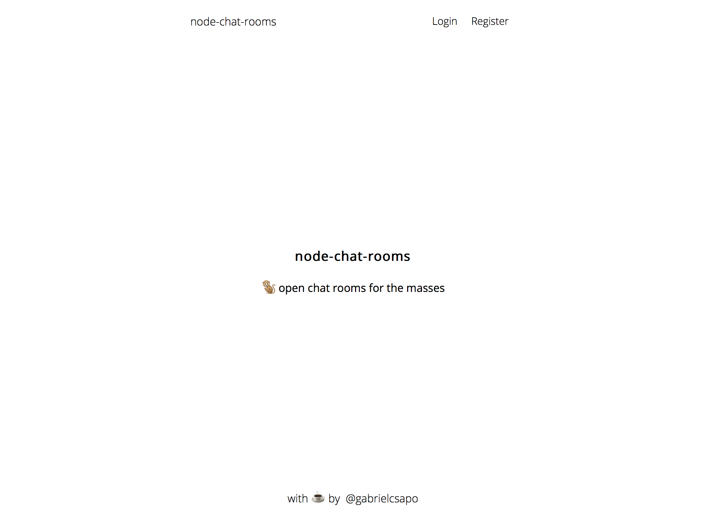

# node-chat-rooms

> 🐒 open chat rooms for the masses

[](https://www.npmjs.com/package/node-chat-rooms)
[](https://travis-ci.org/gabrielcsapo/node-chat-rooms)
[](https://starbuck.gabrielcsapo.com/github/gabrielcsapo/node-chat-rooms)
[](https://starbuck.gabrielcsapo.com/github/gabrielcsapo/node-chat-rooms#info=devDependencies)
[]()
[]()



## Installation

```
npm install node-chat-rooms
```

## Usage

```
MONGO_URL=mongodb://localhost:27017/chatter npm start
```

> docker

```
docker-compose up
```

## Dependencies

- mongodb
